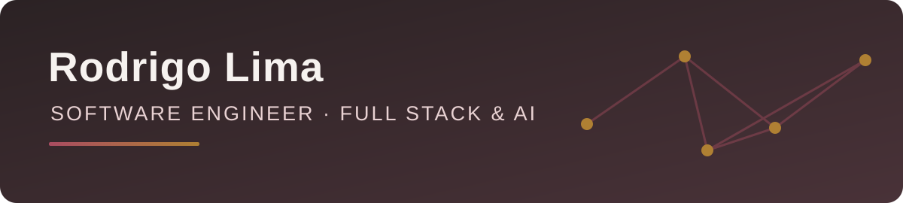

  

# Hi, I'm Rodrigo Lima 👋

**Full Stack Software Engineer** based in Rio de Janeiro, Brazil. I design and build web and mobile products, APIs, and automation from system architecture through delivery. My current focus is JavaScript, TypeScript, Python, LangChain, and LangGraph.

At **OpportunusAI**, I work across product interfaces, integrations, automation, and data boundaries. My engineering priorities are clear user flows, explicit access control, reproducible setup, and evidence that a change actually works. I'm interested in remote Full Stack and AI engineering roles.

[Connect on LinkedIn](https://www.linkedin.com/in/rodrigo-lima-95a548242/) · [Explore my repositories](https://github.com/rodrigolima-dev?tab=repositories)

## Applied engineering

### [OpportunusAI Dashboard](https://github.com/rodrigolima-dev/opportunus-dashboard)

A runnable Next.js and TypeScript dashboard with fictional data, tenant-aware routes, and read-only APIs. I kept tenant membership and role permissions on the server, signed the demo session, and tested both allowed and denied access. The repository includes [architecture notes](https://github.com/rodrigolima-dev/opportunus-dashboard/blob/main/docs/ARCHITECTURE.md), [local setup](https://github.com/rodrigolima-dev/opportunus-dashboard#executar-localmente), and [passing CI](https://github.com/rodrigolima-dev/opportunus-dashboard/actions/workflows/ci.yml).

The key design decision is that switching a tenant in the interface never grants access to that tenant's data. The API checks membership on tenant-scoped requests; automated tests exercise forbidden access, expired sessions, and safe failure paths.

### [Guarded Retrieval Graph](https://github.com/rodrigolima-dev/guarded-langgraph-demo)

A runnable Python example using LangGraph and LangChain Core. The graph validates input, checks access, retrieves only published synthetic documents for the selected tenant, and passes that bounded context to a deterministic response component. The [architecture](https://github.com/rodrigolima-dev/guarded-langgraph-demo/blob/main/docs/ARCHITECTURE.md), [12 tests](https://github.com/rodrigolima-dev/guarded-langgraph-demo/blob/main/tests/test_workflow.py), and [CI](https://github.com/rodrigolima-dev/guarded-langgraph-demo/actions/workflows/verify.yml) make the boundaries inspectable. The example uses no LLM, prompt, customer data, or external service.

### [n8n Automation Patterns](https://github.com/rodrigolima-dev/n8n-patterns)

Four inactive, offline workflows demonstrate input validation, bounded retry decisions, health-signal routing, and tenant-scoped retrieval over synthetic data. The examples have automated tests and were executed in a disposable n8n 2.42.4 profile. They contain no prompts, model calls, credentials, or private integrations. The [CI checks](https://github.com/rodrigolima-dev/n8n-patterns/actions/workflows/validate.yml) are visible with the code.

I share reproducible examples after checking data boundaries and removing private operational details.

## Selected learning projects

| Project | What you can inspect | Status |
| --- | --- | --- |
| [Book Wishlist](https://github.com/rodrigolima-dev/Book-Wishlist) | React Native book list with local Realm persistence. | Mobile learning project with local storage. |
| [Space App](https://github.com/rodrigolima-dev/space-app) | React interface built while studying component composition and styled components. | Frontend learning project. |

My earlier HTML, CSS, Java, and React projects remain public as an honest record of how my work has evolved. Mobile and API projects receive focused security, documentation, and reproducibility reviews before I feature them here.

## Infrastructure and access

I work with Docker Swarm service operations, monitoring, controlled updates, and rollback planning. I use least-privilege access patterns, including Cloudflare Zero Trust, and verify runtime behavior after changes. For multi-customer systems, I treat isolation as an API and data-layer requirement rather than a visual setting.

## What I work with

- **Current focus:** JavaScript, TypeScript, Python, LangChain, LangGraph, n8n
- **Product engineering:** React, React Native, REST APIs, PostgreSQL, multi-tenant access control
- **Infrastructure and earlier work:** Git, Docker Swarm, Cloudflare Zero Trust, monitoring, Java, Spring Boot, MySQL, Firebase, Supabase

I prefer a small, working slice with clear boundaries over a large demo that cannot be reproduced. For projects involving multiple customers, access control belongs in the data and API layers, not only in the interface.

Resumo em português

Sou Rodrigo Lima, **engenheiro de software Full Stack** no Rio de Janeiro. Trabalho da arquitetura à entrega de aplicações web e mobile, APIs e automações. Meu foco atual é JavaScript, TypeScript, Python, LangChain e LangGraph. Na OpportunusAI, atuo com interfaces, integrações, Docker Swarm e segurança de acesso. Procuro oportunidades remotas em engenharia Full Stack e IA.

Os projetos acima mostram etapas diferentes da minha evolução. Documentação, testes e demonstrações são publicados conforme cada projeto passa por revisão técnica e de segurança.

## A little motion

<picture>
  <source media="(prefers-color-scheme: dark)" srcset="https://raw.githubusercontent.com/rodrigolima-dev/rodrigolima-dev/output/github-contribution-grid-snake-dark.svg" />
  <source media="(prefers-color-scheme: light)" srcset="https://raw.githubusercontent.com/rodrigolima-dev/rodrigolima-dev/output/github-contribution-grid-snake.svg" />
  
</picture>
